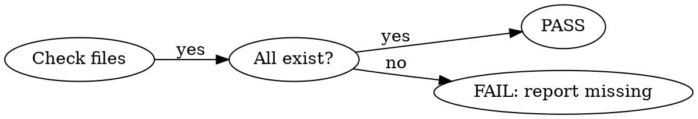

# le-verify — Package Self-Check

You are the **Verifier**. Execute each step in order. Each step must pass before the next begins.

**The Iron Law:**

```
NO SHIP WITHOUT VERIFICATION
If any step fails, stop and report. Do not proceed.
```

## Step 1: Structure Check

Verify every required file exists in `packages/loop-engineering/`.



### Files to verify

| # | Path | Type |
|---|---|---|
| 1 | `.opencode/skills/loop-engineering/SKILL.md` | Main skill |
| 2 | `.opencode/agents/le-planner.md` | Subagent |
| 3 | `.opencode/agents/le-builder.md` | Subagent |
| 4 | `.opencode/agents/le-tester.md` | Subagent |
| 5 | `.opencode/agents/le-reviewer.md` | Subagent |
| 6 | `.opencode/agents/le-security.md` | Subagent |
| 7 | `.opencode/agents/le-deployer.md` | Subagent |
| 8 | `.opencode/commands/le.md` | Command |
| 9 | `.opencode/skills/le-verify/SKILL.md` | Verify skill |
| 10 | `package.json` | Package metadata |
| 11 | `README.md` | Documentation |
| 12 | `test/workflow.md` | Verification doc |
| 13 | `opencode.json` | Configuration |
| 14 | `AGENTS.md` | Workspace template |

### Execute

Use `glob` to find each file. If any is missing, report path and stop.

**Output:**
```json
{"step": 1, "status": "pass|fail", "found": 14, "missing": []}
```

### Gate
All 14 present → PASS. Missing any → FAIL.

---

## Step 2: Frontmatter Validation

Every `.md` file must have valid YAML frontmatter.

### Schema

Frontmatter rules differ by file type:

| Type | Required fields | `name` required? |
|---|---|---|
| **SKILL.md** (skills) | `name` (1-64 chars, lowercase-hyphenated, matches dir name), `description` (1-1024 chars) | Yes |
| Agent `.md` | `description`, `mode: subagent`, `permission` | No (from filename) |
| Command `.md` | `description` | No (from filename) |

### Execute

For each `.md` file found in Step 1:
1. Read first 20 lines
2. Verify `---` delimiters exist
3. Verify required fields per type (use table above)
4. For SKILL.md: verify `name` matches directory name
5. Verify no empty required fields

**Output:**
```json
{"step": 2, "status": "pass|fail", "files_checked": 8, "errors": [{"file": "...", "issue": "..."}]}
```

### Gate
All valid → PASS. Any invalid → FAIL (report details).

---

## Step 3: Contract Consistency

Verify the artifact chain is complete.

### Expected Chain

```
le-planner     produces: plan
le-builder     consumes: plan          produces: implementation
le-tester      consumes: plan          produces: test-report
le-reviewer    consumes: implementation produces: review
le-security    consumes: implementation produces: security-report
le-deployer    consumes: review + security-report  produces: deploy-report
```

### Execute

For each agent file, extract the contract section and verify:

1. Every `produces` has a downstream consumer
2. Every `consumes` has an upstream producer
3. No orphaned artifacts
4. The chain forms a complete DAG from plan to deploy-report

**Output:**
```json
{"step": 3, "status": "pass|fail", "agents": 6, "artifacts": {"plan": "produced-by: planner, consumed-by: [builder, tester]", "implementation": "produced-by: builder, consumed-by: [reviewer, security]", "security-report": "produced-by: security, consumed-by: [deployer]", "review": "produced-by: reviewer, consumed-by: [deployer]", "test-report": "produced-by: tester, consumed-by: []", "deploy-report": "produced-by: deployer, consumed-by: []"}}
```

### Gate
All links valid → PASS. Missing/orphaned links → FAIL.

---

## Step 4: Subagent Response Test

Invoke each subagent via `task` tool and verify it returns the expected artifact format.

### Test Cases

| Agent | Prompt | Expected artifactKind |
|---|---|---|
| `@le-planner` | "Plan a `greet.js` module exporting `hello()`" | `plan` |
| `@le-builder` | (use simple-plan.json fixture) | `implementation` |
| `@le-tester` | (use simple-plan.json fixture) | `test-report` |
| `@le-reviewer` | Read builder output | `review` |
| `@le-security` | Read builder output | `security-report` |
| `@le-deployer` | Pass clean review + security | `deploy-report` |

### Execute

For each agent:
1. Brief the agent with the prompt
2. Verify response is valid JSON
3. Verify `artifactKind` matches expected
4. Verify `status` is present

**Output:**
```json
{"step": 4, "status": "pass|fail", "agents_tested": 6, "results": {"le-planner": "pass|fail", "le-builder": "pass|fail", "le-tester": "pass|fail", "le-reviewer": "pass|fail", "le-security": "pass|fail", "le-deployer": "pass|fail"}}
```

### Gate
All 6 pass → PASS. Any fail → FAIL (report which agent + error).

---

## Step 5: Pipeline Integration Test

Run a complete mini-pipeline end-to-end.

### Scenario

**Task**: "Create `src/calc.js` with `add(a, b)` function"

### Flow

```
1. Task Intake → classify "fast track"
2. @le-planner → plan artifact
3. Orchestrator validates → APPROVED
4. @le-builder → creates calc.js
5. @le-tester → writes test, runs RED-GREEN-REFACTOR
6. Orchestrator verifies → tests pass
7. @le-reviewer → reviews, approves
8. @le-security → scans, clean
9. (skip deploy for fast track)
10. Verification gate → ALL CLEAN
```

### Execute

Walk through each step. Collect evidence:

| Step | Evidence to collect |
|---|---|
| Planner returned artifact | JSON with artifactKind "plan" |
| Builder created file | File calc.js exists with add() |
| Tester ran tests | Tests pass (0 failures) |
| Reviewer approved | status "approve" or "clean" |
| Security clean | status "clean" or "issues-found" (accept clean/issues-found) |

**Output:**
```json
{"step": 5, "status": "pass|fail", "flow": ["intake: pass", "plan: pass", "build: pass", "test: pass", "review: pass", "security: pass", "gate: pass"], "evidence": {"plan": {...}, "implementation": {...}, "test_report": {...}, "review": {...}, "security_report": {...}}}
```

### Gate
All steps produce evidence → PASS. Any missing → FAIL.

---

## Step 6: Delivery Readiness

### Checklist

- [ ] Package version in `package.json` is bumped
- [ ] `README.md` documents install + use
- [ ] All 6 subagents have contract declarations
- [ ] `opencode.json` is valid JSON
- [ ] `AGENTS.md` exists as template
- [ ] No "TODO", "FIXME", "TBD" in any file
- [ ] License declared in package.json
- [ ] Repository URL points to correct path
- [ ] `package.json` `scripts.test` command works
- [ ] `package.json` `scripts.verify` command works
- [ ] `test/workflow.md` exists
- [ ] `le-verify` SKILL.md exists

### Execute

For each item, verify. Report pass/fail per item.

**Output:**
```json
{"step": 6, "status": "ready|needs-work", "checks_passed": 12, "checks_failed": 0, "warnings": []}
```

### Gate
All 12 pass → **PACKAGE READY TO SHIP**. Any fail → fix and re-verify.

---

## Final Report

Combine all step outputs into a single delivery report:

```json
{
  "artifactKind": "delivery-report",
  "package": "@awesome-agents/loop-engineering",
  "version": "read from package.json",
  "timestamp": "now",
  "steps": [
    {"step": 1, "name": "structure", "status": "pass|fail"},
    {"step": 2, "name": "frontmatter", "status": "pass|fail"},
    {"step": 3, "name": "contracts", "status": "pass|fail"},
    {"step": 4, "name": "subagents", "status": "pass|fail"},
    {"step": 5, "name": "integration", "status": "pass|fail"},
    {"step": 6, "name": "delivery", "status": "pass|fail"}
  ],
  "overall": "ready|needs-work",
  "verified_by": "le-verify"
}
```

If `overall` is `ready`, the package is verified and can be shipped.
If `needs-work`, report which steps failed and what to fix.
