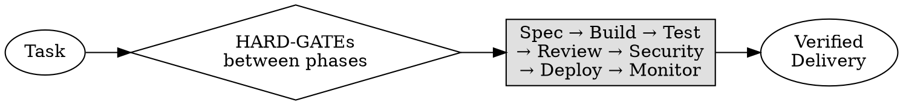

# @awesome-agents/loop-engineering

Full lifecycle engineering pipeline for OpenCode. Turns any multi-step software task into a gated pipeline: **Spec → Build → Test → Review → Security → Deploy → Monitor**.



## Install

```bash
git clone https://github.com/qwqqaqqwq00/awesome-agents
# Then add to your opencode.json:
```

```json
{
  "skills": {
    "paths": ["path/to/awesome-agents/packages/loop-engineering/.opencode/skills"]
  },
  "agent": {
    "build": {
      "permission": {
        "task": {
          "le-planner": "allow",
          "le-builder": "allow",
          "le-tester": "allow",
          "le-reviewer": "allow",
          "le-security": "allow",
          "le-deployer": "allow"
        }
      }
    }
  }
}
```

### Quick Install (monorepo sibling)

If `awesome-agents` is cloned alongside your project:

```json
{
  "skills": {
    "paths": ["../awesome-agents/packages/loop-engineering/.opencode/skills"]
  }
}
```

## Use

```
/le Implement user authentication (register, login, JWT, rate limiting)
```

Or after adjusting the skill description to match your prompt style, the skill auto-activates when you ask for features, refactors, or deployments.

## Architecture

| Phase | Agent | Gate |
|---|---|---|
| **1. Spec & Plan** | `@le-planner` (read-only) | Plan must be approved |
| **2. Build & Test** | `@le-builder` + `@le-tester` | All tests pass |
| **3. Review & Security** | `@le-reviewer` + `@le-security` | Clean review, no vulns |
| **4. Deploy & Monitor** | `@le-deployer` | Canary healthy |

## Iron Laws

```
NO CODE WITHOUT AN APPROVED PLAN
NO MERGE WITHOUT PASSING TESTS
NO DEPLOY WITHOUT SECURITY CLEARANCE
NO COMPLETION CLAIM WITHOUT VERIFICATION EVIDENCE
```

## Self-Verification

The package includes a built-in verification workflow at `test/workflow.md`. Run it to self-check the installation:

```
/le Load skills/loop-engineering/SKILL.md and then follow test/workflow.md
```

## Files

```
.opencode/
├── skills/loop-engineering/SKILL.md      # Main skill (Iron Laws, DOT diagrams, gates)
├── agents/
│   ├── le-planner.md                     # Spec + plan (read-only)
│   ├── le-builder.md                     # Implementation
│   ├── le-tester.md                      # TDD test generation
│   ├── le-reviewer.md                    # Code review (read-only)
│   ├── le-security.md                    # SAST + dependency audit (read-only)
│   └── le-deployer.md                    # Build → canary → verify → rollback
├── commands/le.md                        # /le shortcut
└── .gitignore
test/
├── workflow.md                           # Self-verification workflow
└── fixtures/                             # Test fixtures
AGENTS.md                                 # Workspace constraints template
package.json                              # npm package metadata
README.md                                 # This file
```
