# Loop Engineering — Package Verification Workflow

This workflow validates that the `@awesome-agents/loop-engineering` package is correctly installed, all subagents respond, and the pipeline is functional.

**The Iron Law:**

```
NO SHIP WITHOUT VERIFICATION
This workflow must pass before any release or distribution.
```



```dot
digraph verify_pipeline {
    rankdir=LR;
    structure [label="1: Structure\nCheck files exist", shape=box, style=filled, fillcolor="#c8e6c9"];
    frontmatter [label="2: Frontmatter\nValidate YAML", shape=box, style=filled, fillcolor="#bbdefb"];
    contracts [label="3: Contracts\nproduces/consumes", shape=box, style=filled, fillcolor="#fff9c4"];
    subagents [label="4: Subagents\nEach responds", shape=box, style=filled, fillcolor="#ffe0b2"];
    pipeline [label="5: Pipeline\nSimulate flow", shape=box, style=filled, fillcolor="#e1bee7"];
    delivery [label="6: Delivery\nPackage + report", shape=box, style=filled, fillcolor="#c8e6c9"];
    gate1 [label="All\nexist?", shape=diamond, fillcolor="#f5f5f5"];
    gate2 [label="Valid?", shape=diamond, fillcolor="#f5f5f5"];
    gate3 [label="Match?", shape=diamond, fillcolor="#f5f5f5"];
    gate4 [label="All\npass?", shape=diamond, fillcolor="#f5f5f5"];
    gate5 [label="Flow\nOK?", shape=diamond, fillcolor="#f5f5f5"];

    structure -> gate1;
    gate1 -> frontmatter [label="yes"];
    gate1 -> structure [label="no → fix"];
    frontmatter -> gate2;
    gate2 -> contracts [label="yes"];
    gate2 -> frontmatter [label="no → fix"];
    contracts -> gate3;
    gate3 -> subagents [label="yes"];
    gate3 -> contracts [label="no → fix"];
    subagents -> gate4;
    gate4 -> pipeline [label="yes"];
    gate4 -> subagents [label="no → fix"];
    pipeline -> gate5;
    gate5 -> delivery [label="yes"];
    gate5 -> pipeline [label="no → fix"];
}
```

## Step 1: Structure Check

Verify every required file exists in the package.

### Required files

| Path | Purpose |
|---|---|
| `.opencode/skills/loop-engineering/SKILL.md` | Main skill definition |
| `.opencode/agents/le-planner.md` | Planning subagent |
| `.opencode/agents/le-builder.md` | Building subagent |
| `.opencode/agents/le-tester.md` | Testing subagent |
| `.opencode/agents/le-reviewer.md` | Review subagent |
| `.opencode/agents/le-security.md` | Security subagent |
| `.opencode/agents/le-deployer.md` | Deploy subagent |
| `.opencode/commands/le.md` | `/le` command |
| `package.json` | npm metadata |
| `README.md` | Documentation |
| `test/workflow.md` | This verification workflow |
| `AGENTS.md` | Workspace constraints template |
| `opencode.json` | Project configuration |

### Check

```
Get-ChildItem -Path "packages/loop-engineering" -Recurse -File
```

Verify each path above exists. If any are missing, create them before proceeding.

**Gate**: All files present → PASS. Missing files → FAIL (fix before continuing).

## Step 2: Frontmatter Validation

Every `SKILL.md` and agent `.md` file must have valid YAML frontmatter.

### Schema

| Field | Required | Rules |
|---|---|---|
| `name` | Yes | 1-64 chars, lowercase-hyphenated, matches directory name |
| `description` | Yes | 1-1024 chars, includes trigger keywords |
| `mode` | Yes (agents) | Must be `subagent` |
| `permission` | Yes (agents) | Valid tool permissions |
| `shell-timeout` | No | Integer seconds |
| `contract` | No | Structured produces/consumes |
| `argument-hint` | No | String |

### Check

For each `.md` file in the package, verify:
1. `---` delimiters exist at start
2. YAML parses without errors
3. Required fields are present
4. No unknown fields

**Gate**: All frontmatter valid → PASS. Any invalid → FAIL.

## Step 3: Contract Consistency

Each subagent declares a `contract` (produces/consumes). Verify they form a complete chain.

### Artifact Chain

```
le-planner     → produces: plan
le-builder     → consumes: plan,  produces: implementation
le-tester      → consumes: plan,  produces: test-report
le-reviewer    → consumes: implementation,  produces: review
le-security    → consumes: implementation,  produces: security-report
le-deployer    → consumes: review + security-report,  produces: deploy-report
```

### Check

```
1. Does every produces have a matching consumes downstream?
2. Are there any orphaned artifacts (consumed but never produced)?
3. Does the chain form a complete pipeline?
```

**Gate**: Chain complete → PASS. Missing links → FAIL.

## Step 4: Subagent Response Check

Each subagent must respond correctly when invoked.

### Test Plan

For each subagent, invoke it via the `task` tool with a minimal prompt and verify it returns the expected artifact format.

| Subagent | Input | Expected Output |
|---|---|---|
| `@le-planner` | "Plan a simple hello-world function" | JSON with `artifactKind: "plan"`, `status: "ready"` |
| `@le-builder` | Approved plan for hello-world | JSON with `artifactKind: "implementation"` |
| `@le-tester` | Same plan | JSON with `artifactKind: "test-report"` |
| `@le-reviewer` | Implementation from builder | JSON with `artifactKind: "review"` |
| `@le-security` | Implementation from builder | JSON with `artifactKind: "security-report"` |
| `@le-deployer` | Clean review + security | JSON with `artifactKind: "deploy-report"` |

### Execution

```bash
# In opencode session:
/le verify:subagent le-planner "create a simple hello world function"
/le verify:subagent le-builder "implement the hello world plan"
# ... etc for each subagent
```

**Gate**: All 6 subagents return correct artifact format → PASS. Any subagent fails → FAIL.

## Step 5: Pipeline Integration Test

Simulate a complete mini-pipeline to verify end-to-end flow.

### Scenario

**Task**: "Create a `greet.js` module with a `hello()` function that returns 'Hello, World!'"

### Expected Flow

```
1. Task Intake → classify as "fast track" (small feature)
2. @le-planner → plan artifact (1 file: greet.js, 1 test file)
3. Orchestrator validates → APPROVED
4. @le-builder → creates greet.js with hello()
5. @le-tester → writes test, runs RED-GREEN-REFACTOR
6. Orchestrator verifies → tests pass
7. @le-reviewer → reviews, approves
8. @le-security → scans, clean
9. (Deploy skipped for fast track)
10. Verification gate → ALL CLEAN
```

### Evidence Collection

For each step, collect evidence:
- Planner: Was a plan artifact returned?
- Builder: Was code created?
- Tester: Did tests pass?
- Reviewer: Was review clean?
- Security: Was scan clean?

**Gate**: All 5 steps produce evidence → PASS. Any missing → FAIL.

## Step 6: Delivery Check

### Readiness Checklist

Before marking the package as ready to publish:

- [ ] Package version in `package.json` is bumped (semver)
- [ ] `README.md` documents install instructions
- [ ] `README.md` documents usage instructions
- [ ] All 6 subagents listed with their roles
- [ ] Iron Laws documented
- [ ] Verification workflow exists in `test/workflow.md`
- [ ] `opencode.json` is valid JSON (no syntax errors)
- [ ] `AGENTS.md` exists as workspace template
- [ ] All files have consistent frontmatter style
- [ ] No placeholder markers (the words TODO / FIXME / TBD as standalone tokens, not as references)
- [ ] License is declared
- [ ] Repository URL in `package.json` points to correct path

### Output

Generate a delivery report:

```json
{
  "artifactKind": "delivery-report",
  "status": "ready|needs-work",
  "data": {
    "package": "@awesome-agents/loop-engineering",
    "version": "0.1.0",
    "checks_passed": 12,
    "checks_failed": 0,
    "warnings": [],
    "verified_by": "loop-engineering test/workflow.md"
  }
}
```

**Gate**: All 12 checks pass → READY TO SHIP. Any fail → fix and re-verify.

## Anti-Rationalization

| Excuse | Reality |
|---|---|
| "I only changed one file, skip verification" | One file change can break the whole chain |
| "The subagents work, I tested manually" | Manual ≠ systematic. Run the workflow |
| "I'll fix the frontmatter later" | Later = never. Fix now |
| "The contracts look right" | Verify, don't assume |
| "Version bump is trivial" | Wrong version = broken installs |

## Red Flags — STOP

- Missing files that are not caught by the workflow
- Subagent returning plain text instead of JSON contract
- Pipeline reaching deploy without all prior gates passing
- Delivery report generated without running all 6 steps
- Any "I'll do it later" during verification
